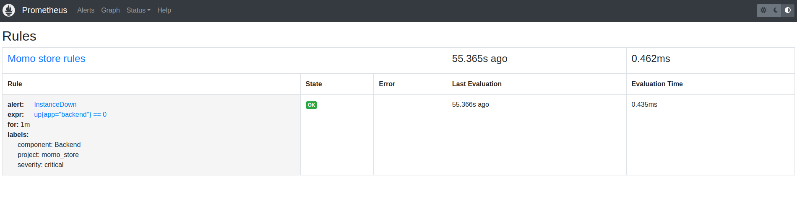
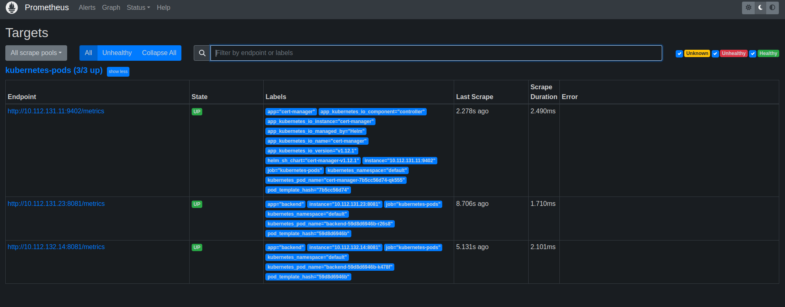
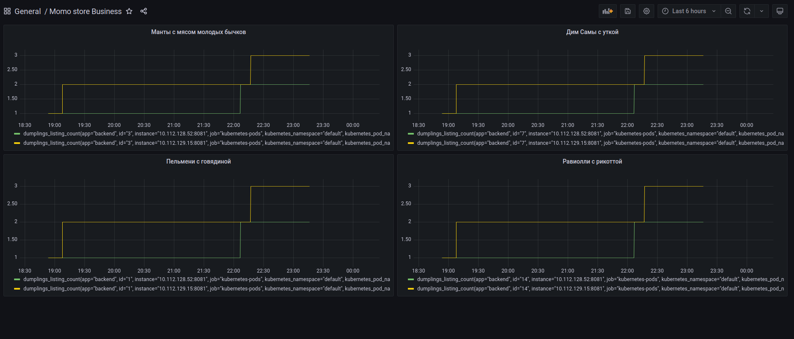
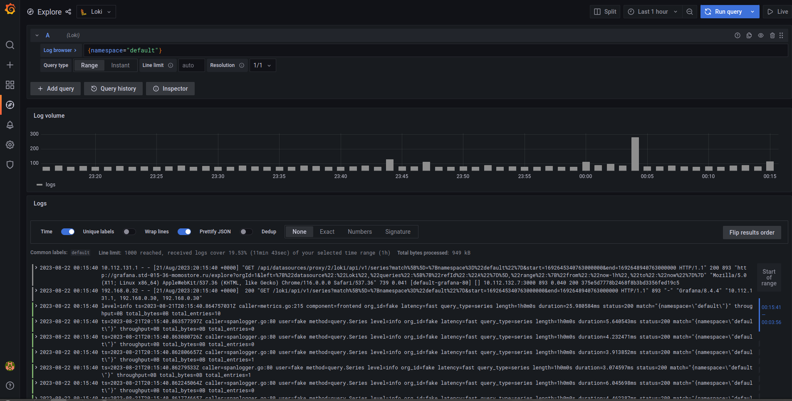
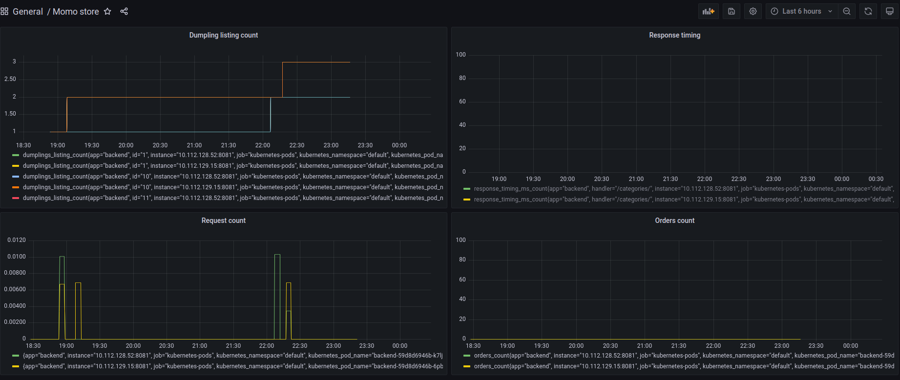

# Momo Store aka Пельменная №2


## Frontend

```bash
npm install
NODE_ENV=/ VUE_APP_API_URL=http://localhost:8081 npm run serve
```

## Backend

```bash
go run ./cmd/api
go test -v ./... 
```

# Momo Store

## Структура проекта

* **backend** - содержит исходный код, Dockerfile для сборки Docker-образа бэкенда, .gitlab-ci.yaml содержит стадии сборки образа, тестирования (*Gitlab SAST и SonarQube*), публикации Docker-образа в [Gitlab Container Registry](https://gitlab.praktikum-services.ru/std-015-36/momo-store/container_registry).
* **frontend** - содержит исходный код, Dockerfile для сборки Docker-образа фронтенда, .gitlab-ci.yaml содержит стадии сборки образа, тестирования (Gitlab SAST и SonarQube), публикации Docker-образа в [Gitlab Container Registry](https://gitlab.praktikum-services.ru/std-015-36/momo-store/container_registry). HTML-страница раздаётся с Nginx.
* **infrastructure/kubernetes/** - содержит Kubernetes-манифесты для публикации приложения.
* **infrastructure/terraform/** - конфигурационные файлы terraform для развертывания Kubernetes кластера в Yandex Cloud.
* **infrastructure/momo-chart/** - helm-чарты для развертывания приложения momo-store в Kubernetes кластере; .gitlab-ci.yaml содержит стадии релиза helm-чарта в Nexus и стадию деплоя в Kubernetes кластер.

## Infrastructure
* docker-images ---> [Gitlab Container Registry](https://gitlab.praktikum-services.ru/std-015-36/momo-store/container_registry).
* анализ кода ---> Gitlab SAST и [SonarQube](https://sonarqube.praktikum-services.ru/)
* терраформ бэкэнд и  статика ---> Yandex Object Storage
* деплой ---> Yandex Managed Service for Kubernetes
* helm-charts ---> [Nexus](https://nexus.k8s.praktikum-services.tech/)

## Создание Kubernetes Cluster
С помощью terraform создается вся необходимая инфраструктура в Yandex.Cloud:
* [кластер Managed Service for Kubernetes](https://cloud.yandex.ru/docs/managed-kubernetes/operations/kubernetes-cluster/kubernetes-cluster-create)
* [группа узлов](https://cloud.yandex.ru/docs/managed-kubernetes/operations/node-group/node-group-create)

Далее необходимо:
* получить [iam-token](https://cloud.yandex.ru/docs/iam/operations/iam-token/create), выполнить ```export YC_TOKEN=<ВАШ IAM ТОКЕН>```.
* cоздать [Object Storage](https://cloud.yandex.ru/docs/storage/quickstart), внести параметры подключения в файл infrastructure/terraform/provider.tf
* выполнить:
```
cd infrastructure/terraform
terraform init
terraform validate
terraform apply

#для подключения к внешнему IP-адресу кластера через интернет
yc managed-kubernetes cluster get-credentials <идентификатор или имя кластера> --external
```

## Production

```
#устанавливаем Ingress-контроллер NGINX
helm repo add ingress-nginx https://kubernetes.github.io/ingress-nginx && \
helm repo update && \
helm install ingress-nginx ingress-nginx/ingress-nginx

#устанавливаем менеджер сертификатов
helm repo add jetstack https://charts.jetstack.io
helm repo update
helm upgrade --install --atomic -n default cert-manager jetstack/cert-manager --version v1.12.1 --set installCRDs=true

helm install momo-store ./momo-chart

#узнаем IP-адрес Ingress-контроллера 
kubectl get svc

#на DNS-сервере A-запись, указывающую на публичный IP-адрес Ingress-контроллера.
```
### Приложение доступно [Momo store](http://store.std-015-36-momostore.ru)

## Мониторинг

* скопировать [репозитории](https://gitlab.praktikum-services.ru/root/monitoring-tool)
* в deployment.yaml бэкэнда добавить:
``` 
prometheus.io/path: /metrics
prometheus.io/port: "8081"
prometheus.io/scrape: "true"
```
*  установить grafana и prometheus
```
helm upgrade --install grafana  grafana
helm upgrade --install prometheus prometheus
```
* [установить Loki](https://cloud.yandex.ru/docs/managed-kubernetes/operations/applications/loki)

### [Prometheus](https://prometheus.std-015-36-momostore.ru/targets?search=)




### [Grafana](http://grafana.std-015-36-momostore.ru)






